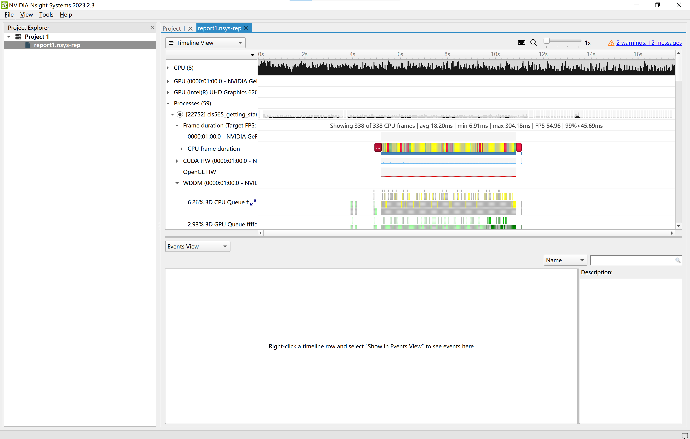
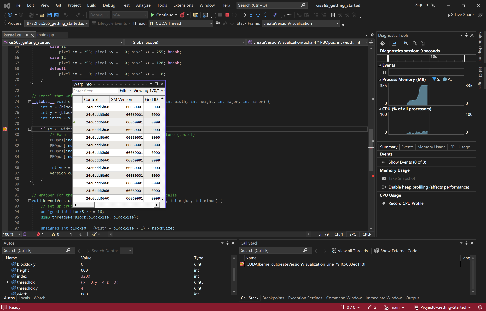
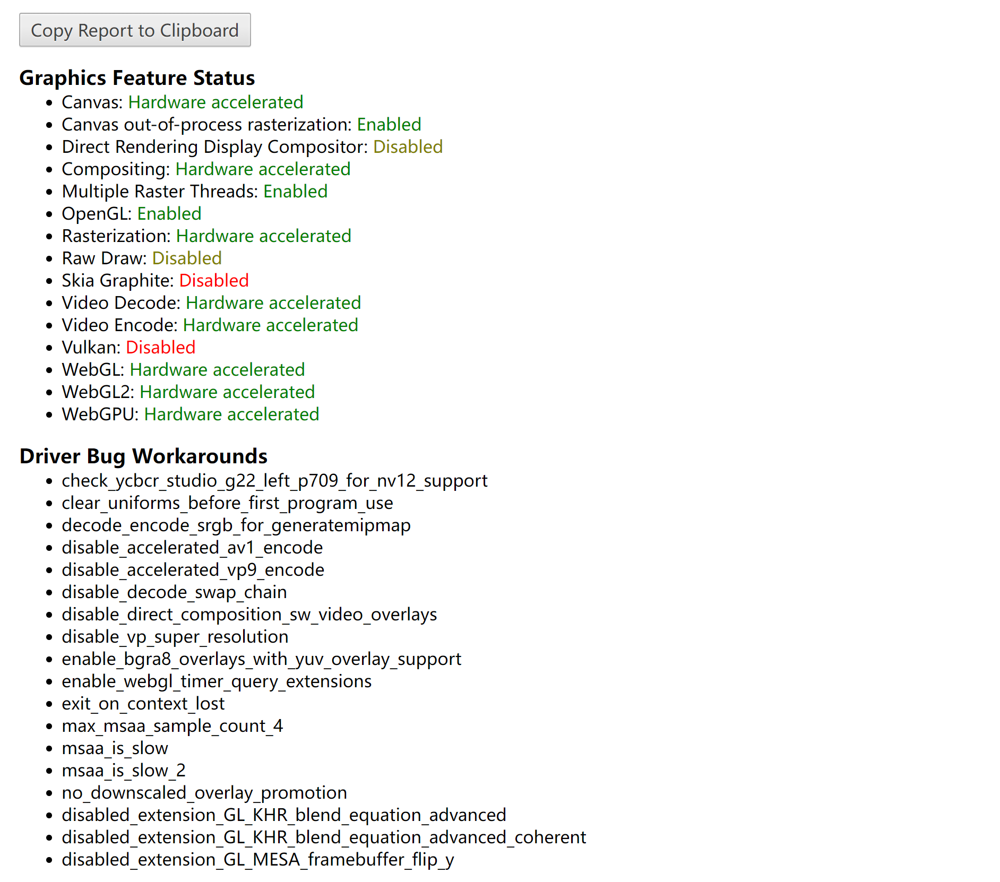

Project 0 Getting Started
====================

**University of Pennsylvania, CIS 565: GPU Programming and Architecture, Project 0**

* Yian Chen
  * [LinkedIn](https://www.linkedin.com/in/yian-chen-33a31a1a8/), [personal website](https://sydianandrewchen.github.io/) etc.
* Tested on: Windows 10, i5-8250U CPU @ 1.60GHz 8GB, NVIDIA GeForce MX150 6GB

## Part 3.1

- GPU: NVIDIA GeForce MX150 6GB
- Compute Capability: 6.1 
  > Note: It appears that MX150 is not listed in the [link](https://developer.nvidia.com/cuda-gpus). The shown `sm` is proposed according to [this post](https://forums.developer.nvidia.com/t/which-version-of-cuda-is-compatible-with-nvidia-mx-150/74400).

### 3.1.1

- Screenshot of the window:
  

### 3.1.2

- Screenshot of the nsight timeline:
  

### 3.1.3

- Screenshot of the nsight debugging:
  

## Part 3.2

- Screenshot of `chrome://gpu`:
  

## Part 3.3

- Screenshot of DXR check & modified triangle:
  

