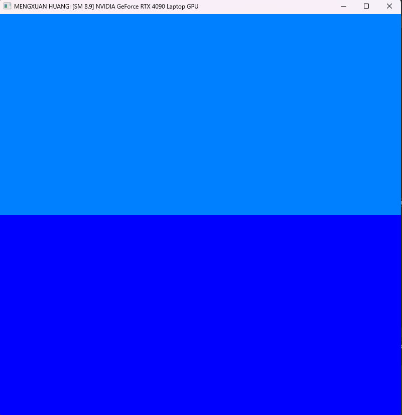
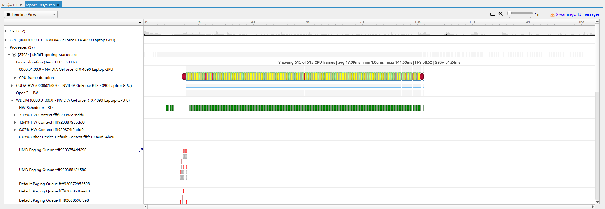
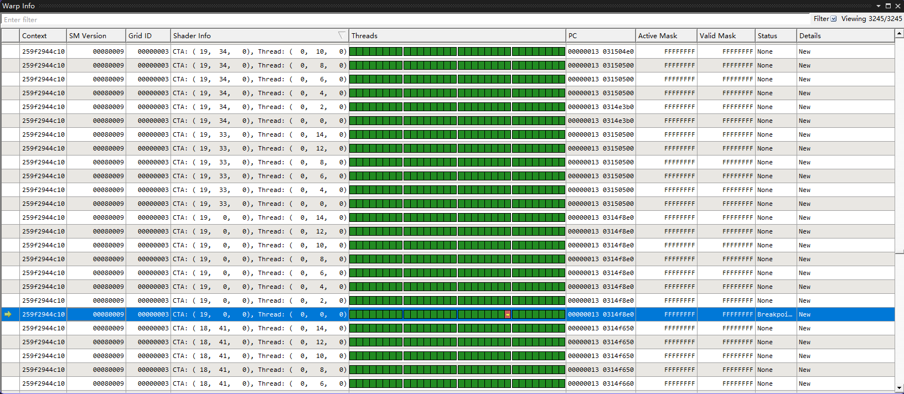
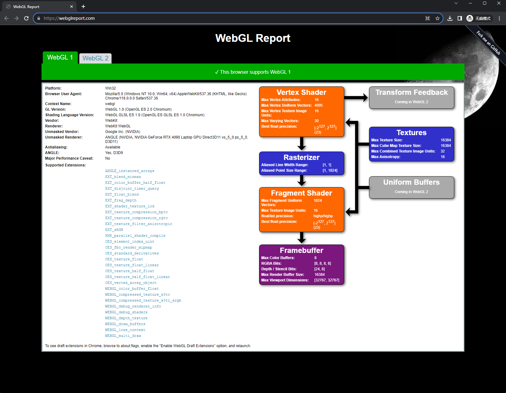
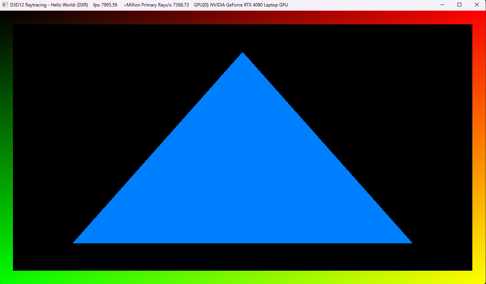

Project 0 Getting Started
====================

**University of Pennsylvania, CIS 565: GPU Programming and Architecture, Project 0**

* Mengxuan Huang
  * [LinkedIn](https://www.linkedin.com/in/mengxuan-huang-52881624a).
* Tested on: Windows 11, i9-13980HX @ 2.22GHz 64.0 GB, RTX4090-Laptop 16384MB

## Part 3.1: CUDA
8  -> Dodger Blue    #0080ff     rgb(  0, 128, 255)

9  -> Blue           #0000ff     rgb(  0,   0, 255)

## Part 3.1.2: Analyze

## Part 3.1.3: Nsight Debugging
**Random Number: 1111**

BlockId(19, 0, 0) ThreadId:(7, 1, 0)

## Part 3.2: WebGL
**Support WebGL**

## Part 3.3: DXR
**GPU has full hardware support for DXR**

