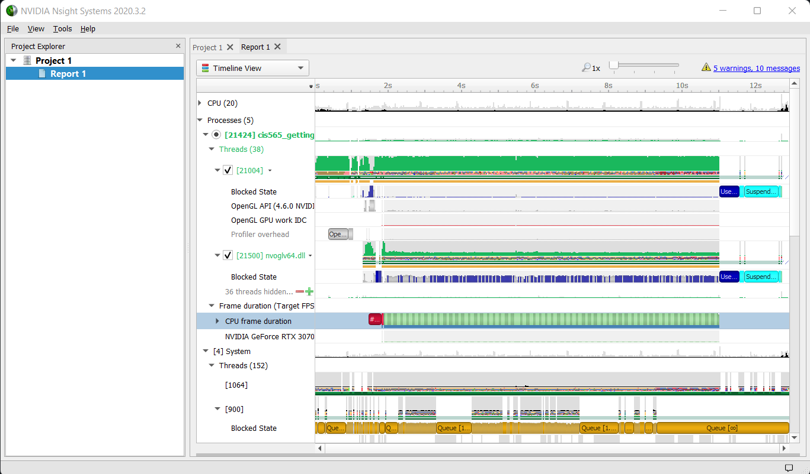
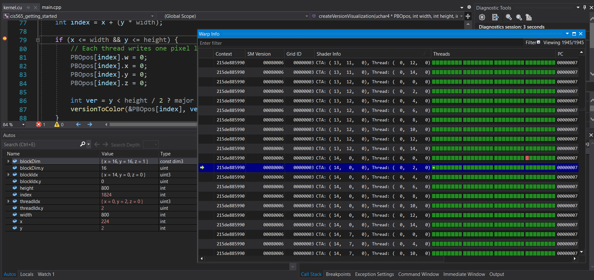
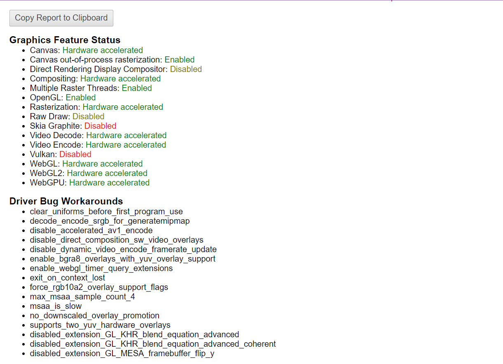

Project 0 Getting Started
====================

**University of Pennsylvania, CIS 565: GPU Programming and Architecture, Project 0**

* Linda Zhu
  * [LinkedIn](https://www.linkedin.com/in/lindadaism/), [Portfolio](https://lindadaism.com/)
* Tested on:

             OS:	        Windows 11 Home
             Processor:	12th Gen Intel(R) Core(TM) i7-12800H   2.40 GHz
             Graphics:	NVIDIA GeForce RTX 3070 Ti
             Storage:	        1 TB SSD
             Installed RAM:	16.0 GB (15.7 GB usable)
             System type:	64-bit operating system, x64-based processor

### Test Results
#### CUDA Screenshot

#### Nsight Profiling

#### Nsight Debugging

#### WebGL

#### DXR

