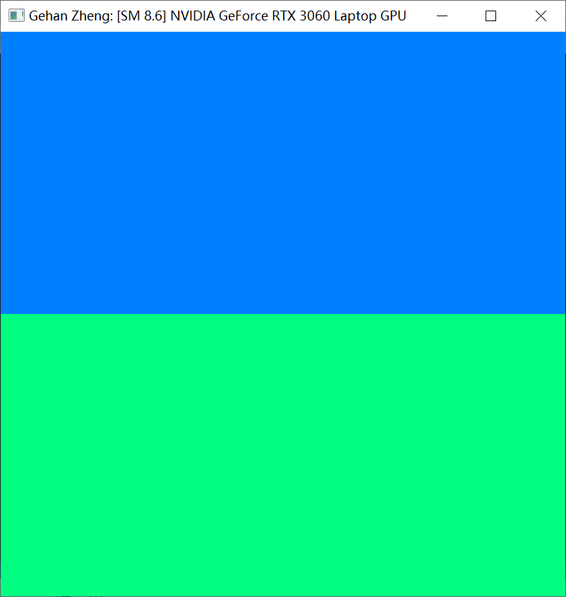
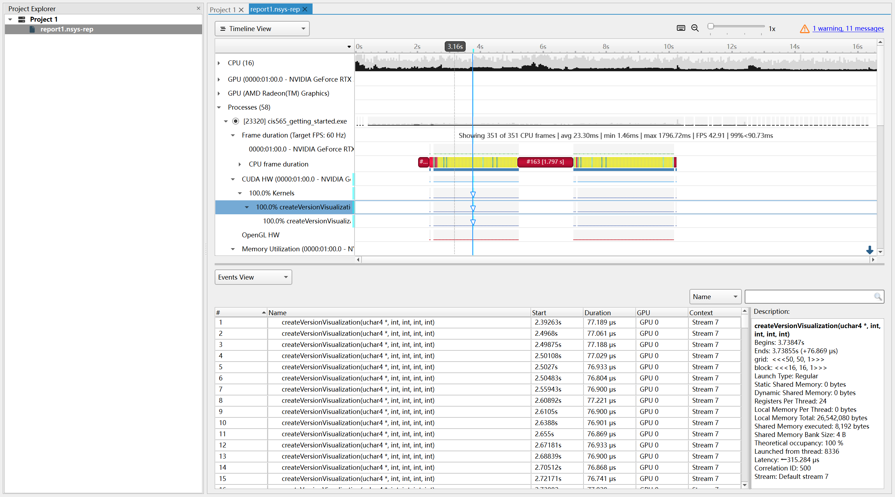
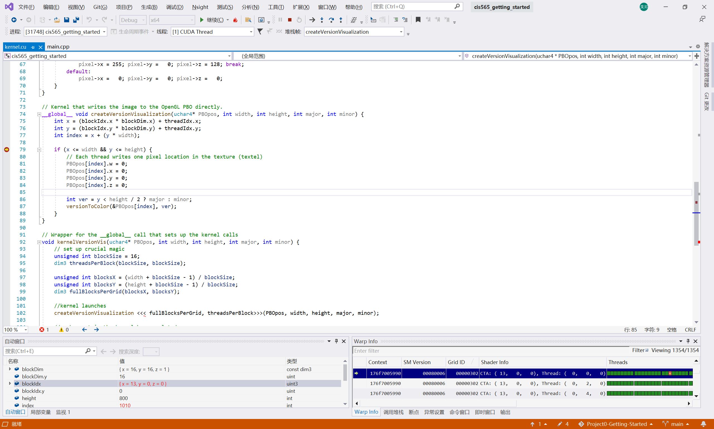
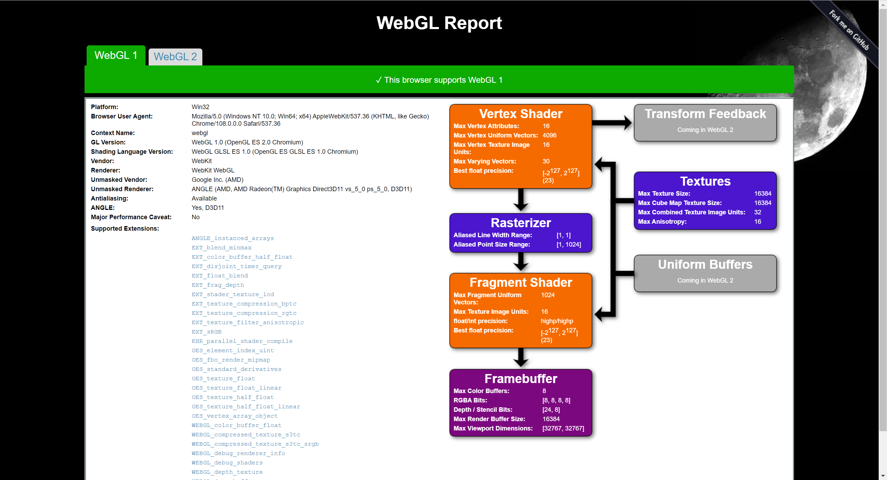
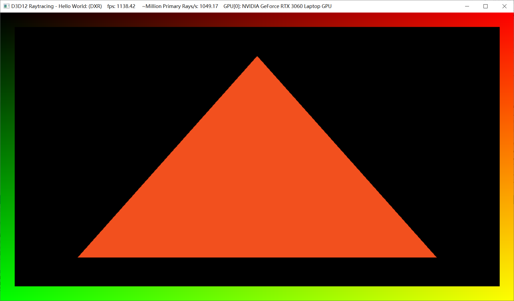

Project 0 Getting Started
====================

**University of Pennsylvania, CIS 565: GPU Programming and Architecture, Project 0**

* Gehan Zheng
  * [LinkedIn](https://www.linkedin.com/in/gehan-zheng-05877b24a/), [personal website](https://grahamzen.github.io/).
* Tested on: Windows 10, AMD Ryzen 7 5800H @ 3.2GHz 16GB, GeForce RTX 3060 Laptop 6144MB (Personal Laptop)

### Part 3.1: CUDA

Compute Capability: 8.6

### Part 3.1.1: Modify the CUDA Project and Take a Screenshot

### Part 3.1.2: Analyze

### Part 3.1.3: Nsight Debugging

### Part 3.2: WebGL

### Part 3.3: DXR

