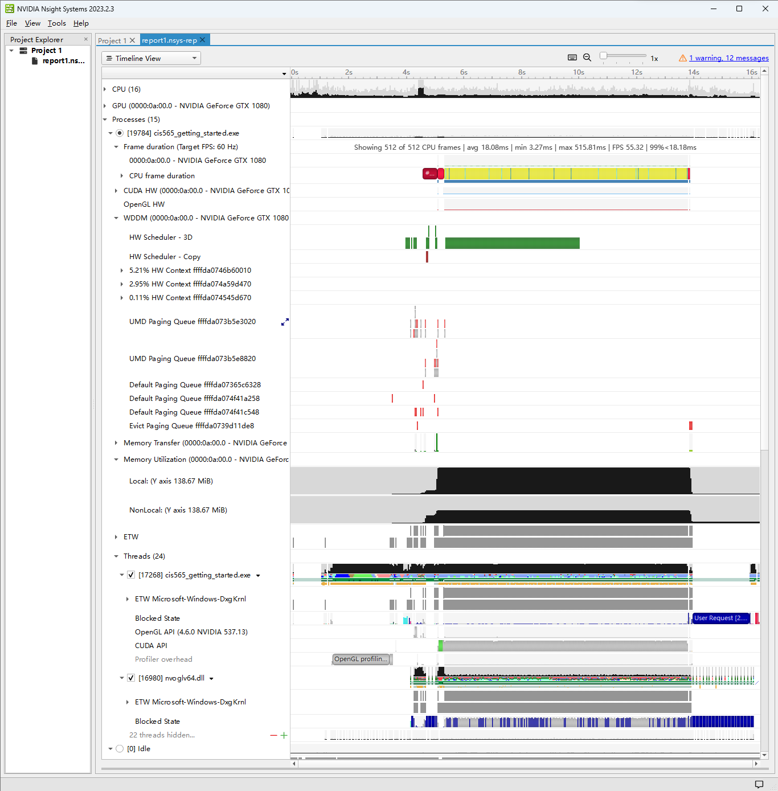
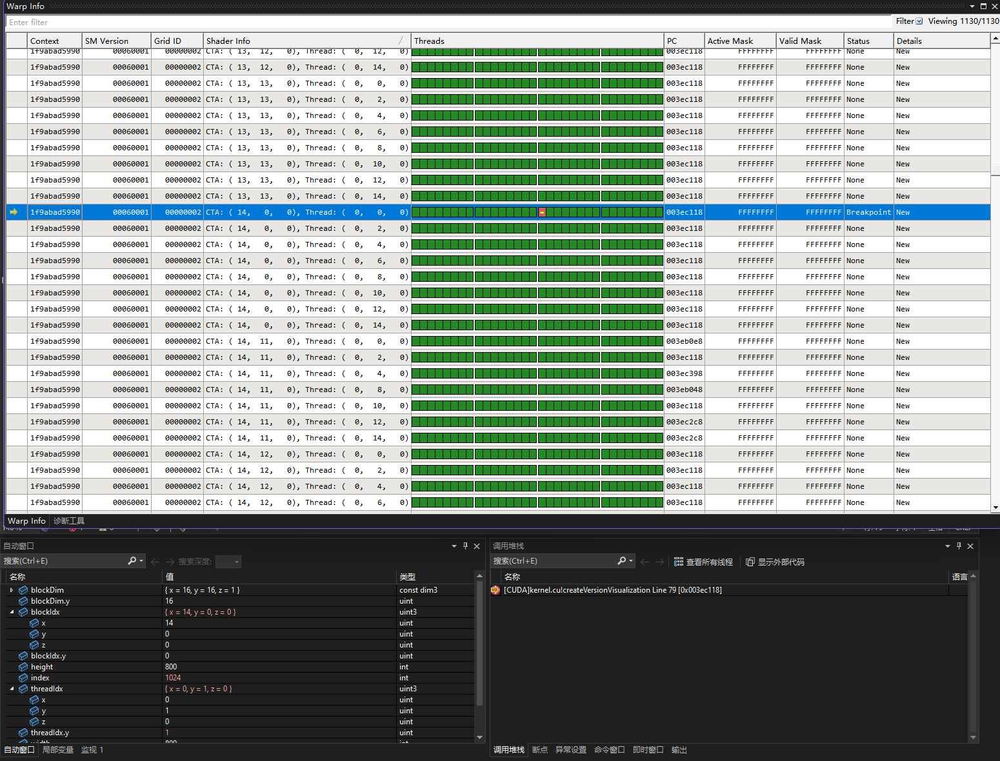
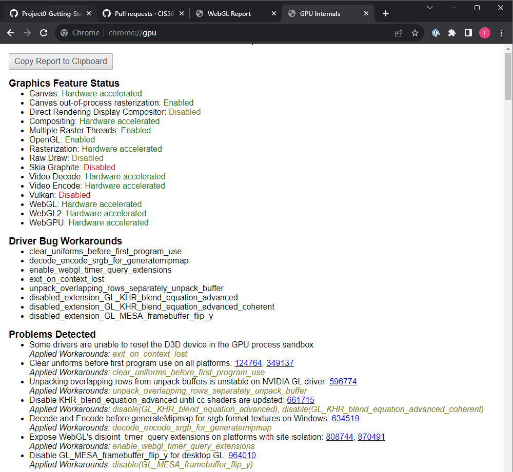
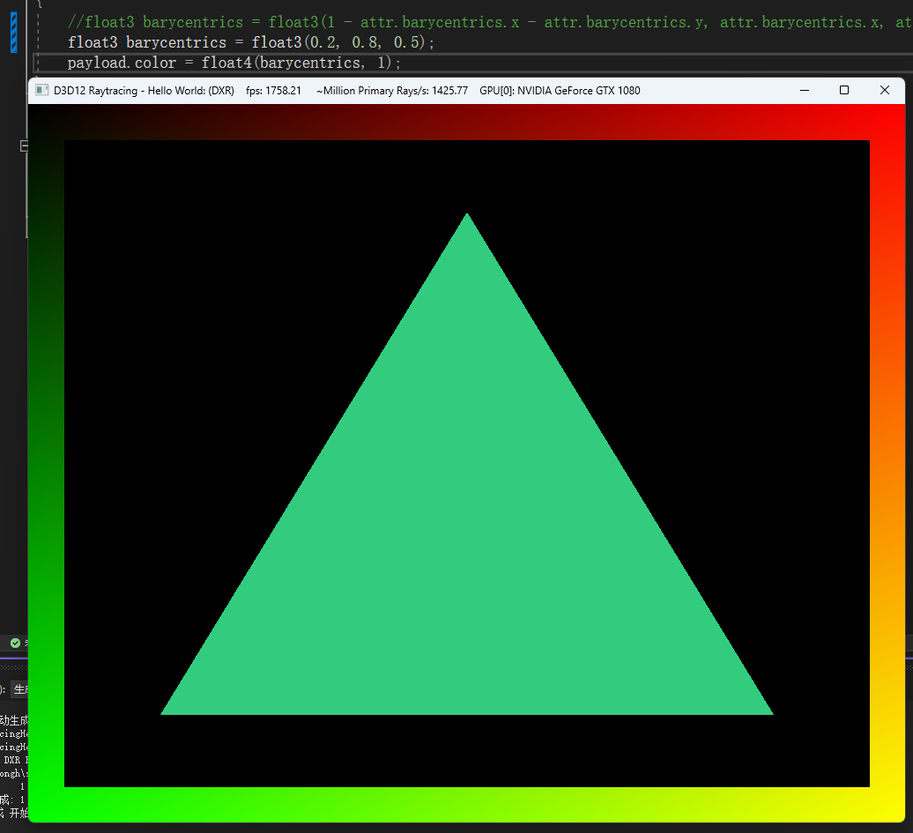

Project 0 Getting Started
====================

**University of Pennsylvania, CIS 565: GPU Programming and Architecture, Project 0**

* Tong Hu 
  * [LinkedIn](https://www.linkedin.com/in/tong-hu-5819a122a/).
* Tested on: Windows 11, Ryzen 7 1700X @ 3.4GHz 16GB, GTX 1080 16GB (Personal Computer)

### Screenshots

Figure 1. Screenshot of modified CUDA project in Part 3.1.1.

Figure 2. Screenshot of Nsight in Part 3.1.2.

Figure 3. Screenshot of warp info in Part 3.1.3.

Figure 4. Screenshot of webgl status in Part 3.2.

Figure 5. Screenshot of DXR test after changing in Part 3.3.