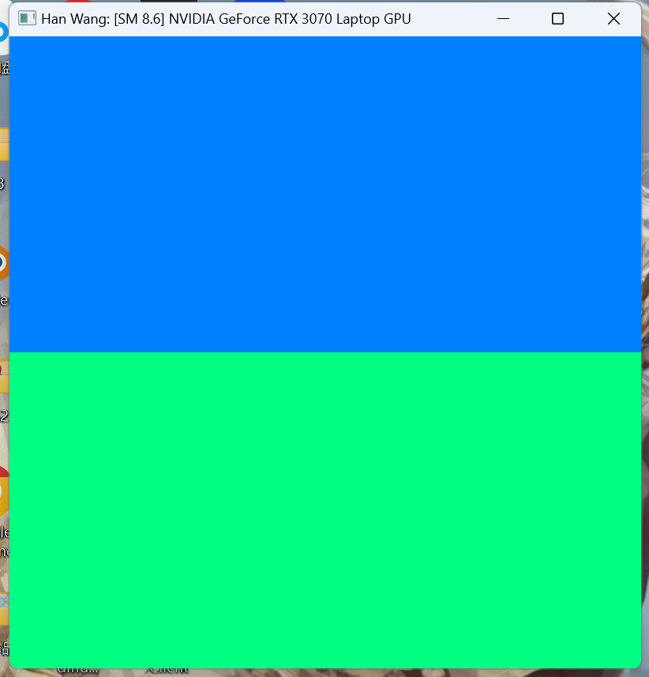

Project 0 Getting Started
====================

**University of Pennsylvania, CIS 565: GPU Programming and Architecture, Project 0**

* Han Wang
  * 
* Tested on: (TODO) Windows 11, 11th Gen Intel(R) Core(TM) i9-11900H @ 2.50GHz   2.50 GHz 24GB, GeForce RTX 3070 

### (TODO: Your README)

