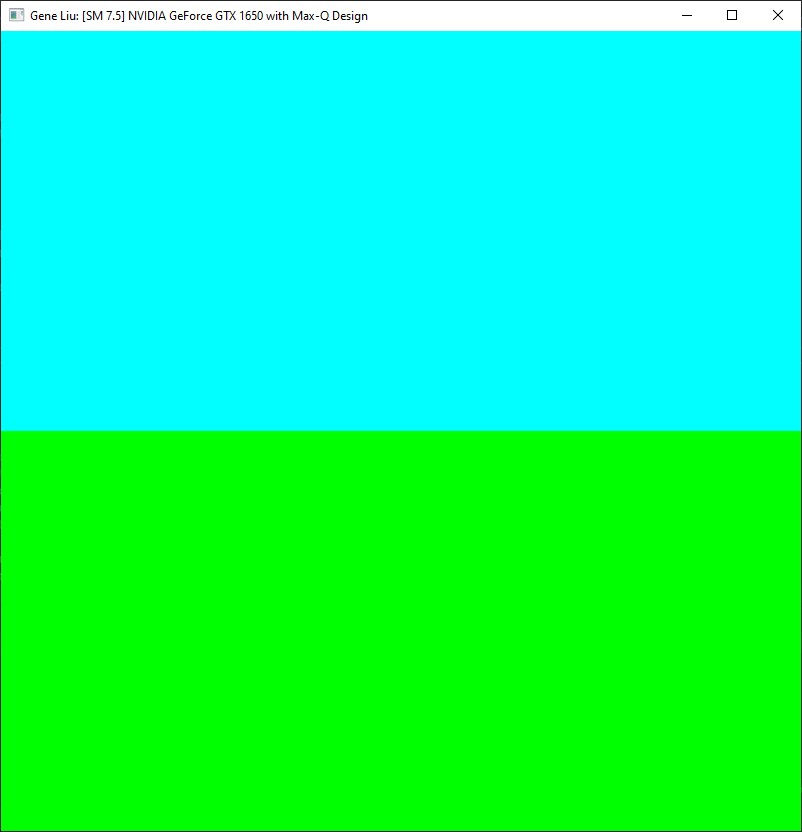
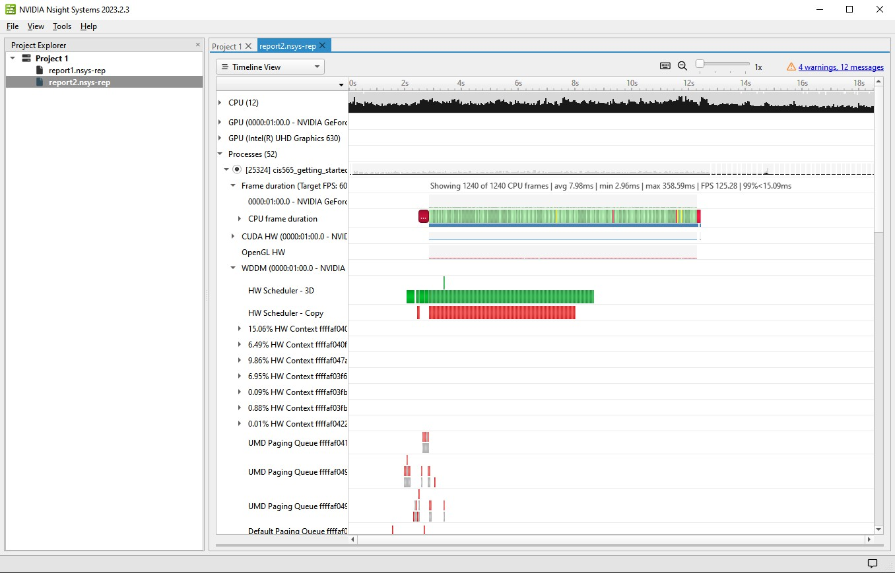
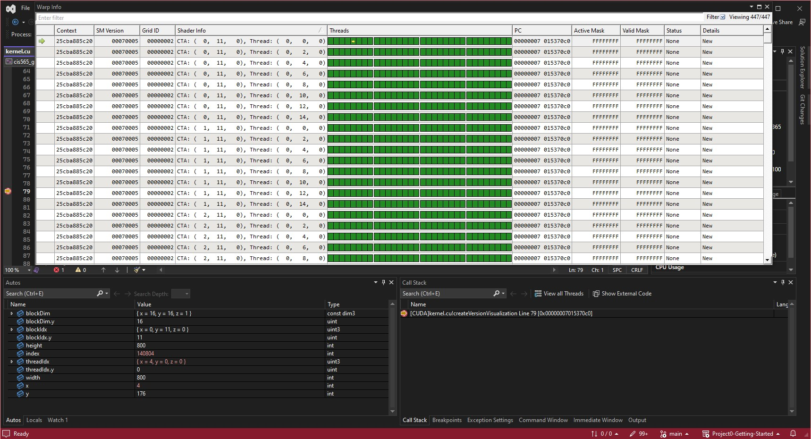
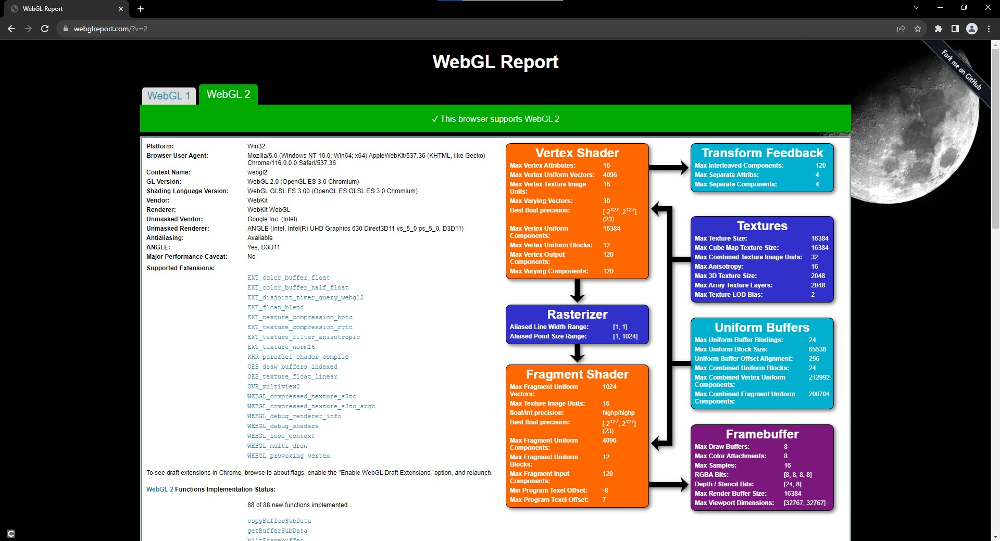
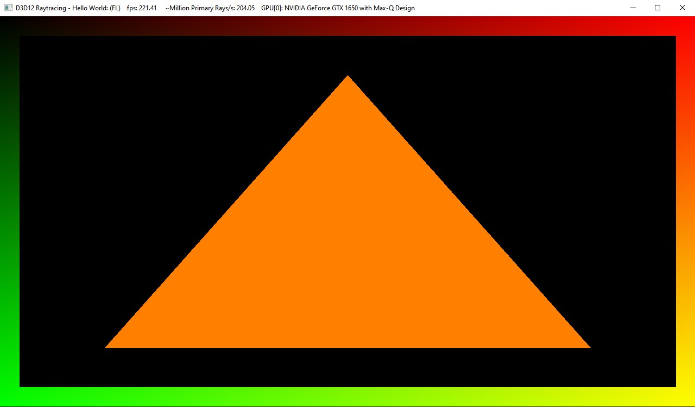

Project 0 Getting Started
====================

**University of Pennsylvania, CIS 565: GPU Programming and Architecture, Project 0**

* Gene Liu
  * [LinkedIn](https://www.linkedin.com/in/gene-l-3108641a3/)
* Tested on: Windows 10, i7-9750H @ 2.60GHz, 16GB RAM, GTX 1650 Max-Q 4096MB (personal laptop)
  * SM 7.5

### Screenshots

3.1.1

3.1.2

3.1.3

3.2

3.3

