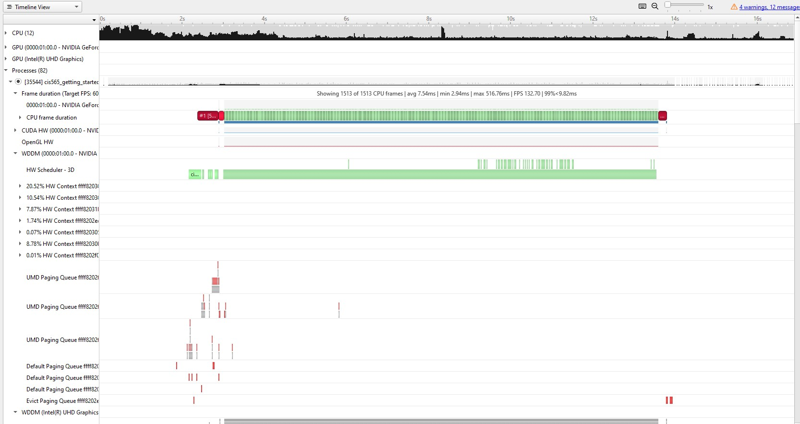
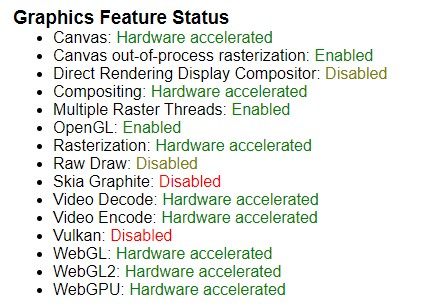

Project 0 Getting Started
====================

**University of Pennsylvania, CIS 565: GPU Programming and Architecture, Project 0**

* Helena Zhang
* Tested on: Windows 11, i7-10750 @ 2.6GHz 16GB, Geforce RTX 2060 6GB

### README

Compute Capability of Geforce RTX 2060: 	7.5

Running starter project

Nsight Timeline

webGL enabled on chrome

DXR enabled
