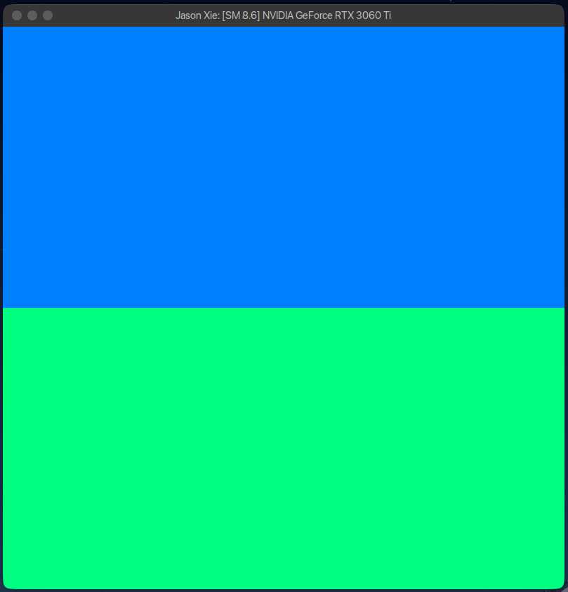
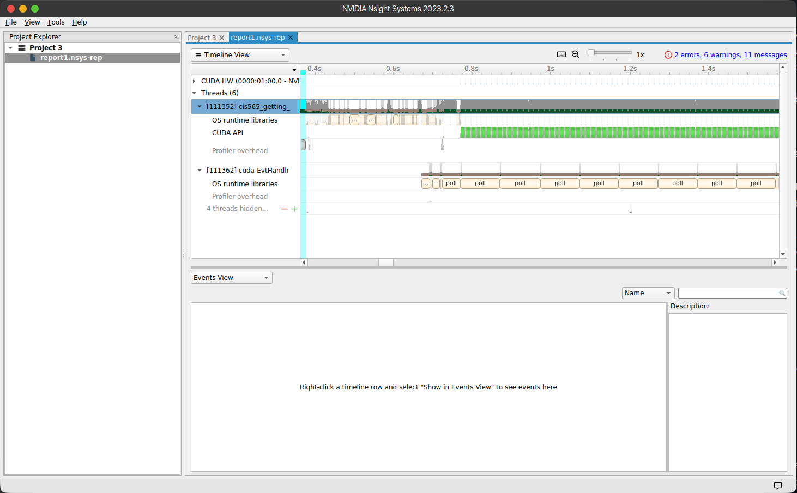
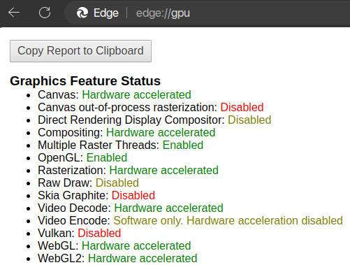

Project 0 Getting Started
====================

**University of Pennsylvania, CIS 565: GPU Programming and Architecture, Project 0**

**Jason Xie**

[🤓 LinkedIn](https://linkedin.com/in/jia-chun-xie)

[😇 my website](https://jchunx.dev)

[🥵 X (formerly 🐦)](https://x.com/codemonke_)

Tested on: Ubuntu 22.04, i5-8400, RTX 3060Ti, personal machine

### Results

GPU Compute capability: 8.6

* No access to Windows machine, so no DXR results for now.