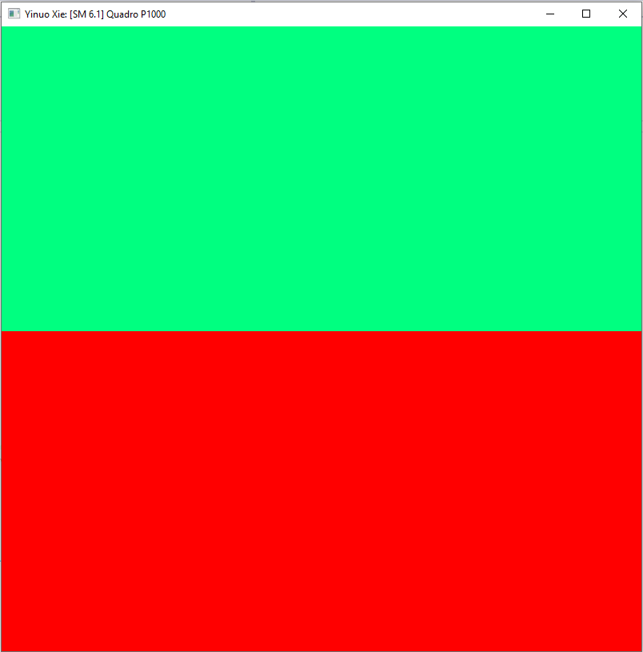
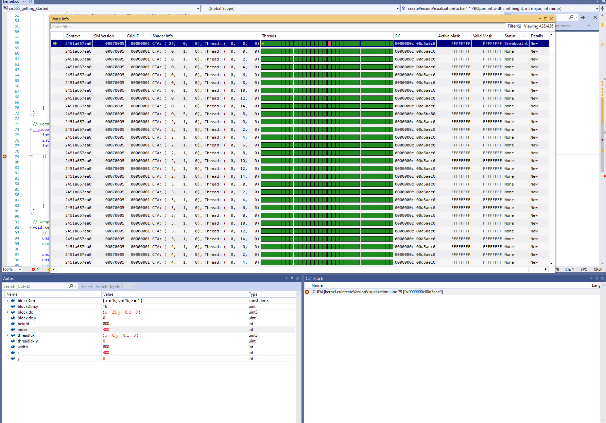
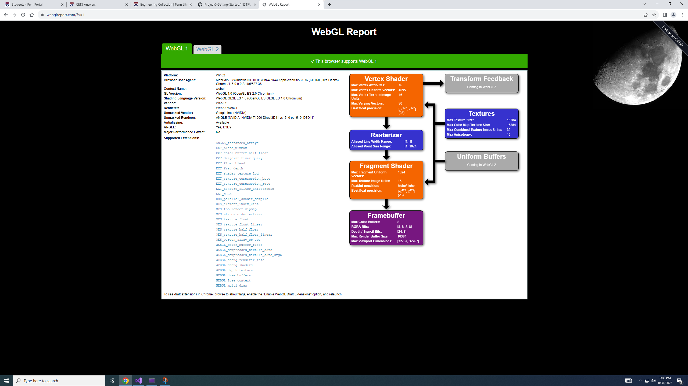

Project 0 Getting Started
====================

**University of Pennsylvania, CIS 565: GPU Programming and Architecture, Project 0**

* Yinuo (Travis) Xie
  * [LinkedIn(https://www.linkedin/com/in/yinuotxie/)
* Tested on: Windows 10, i7-12700 @2.10GHz 32GB, NVIDIA T1000 (Moore Windows PC Lab)

**Screenshots

Part 3.1.1: Cuda

Part 3.1.2: Analyze

Part 3.1.3: Nsight Debugging 

Part 3.2: WebGL

Part 3: DXR

