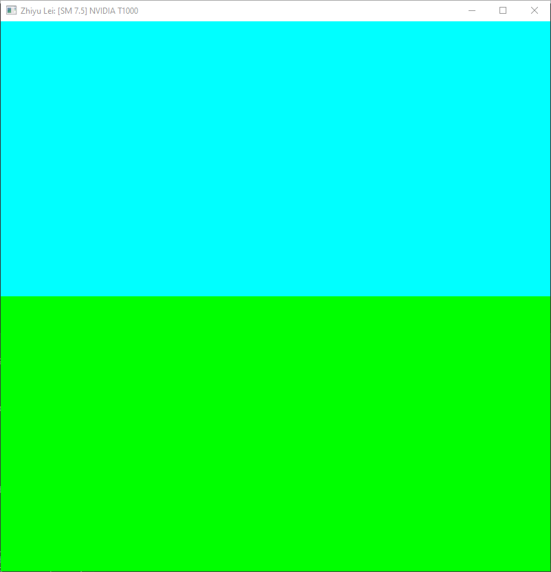
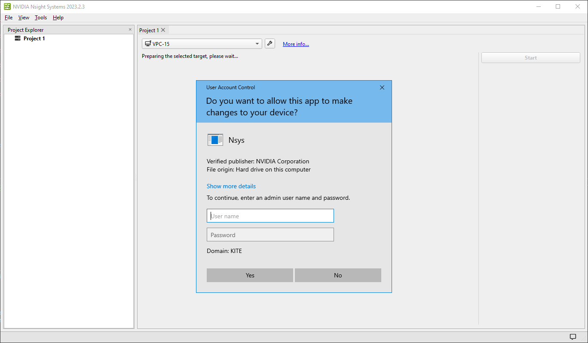
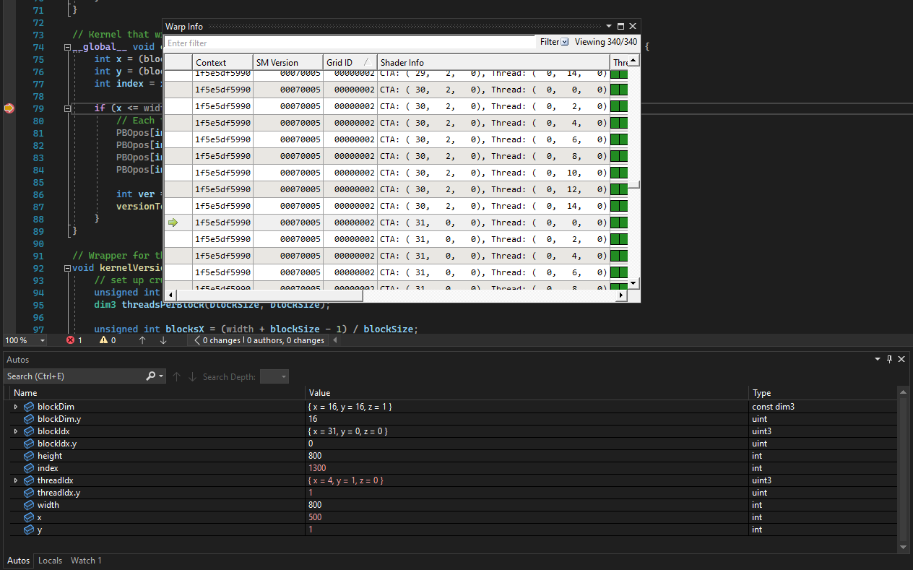
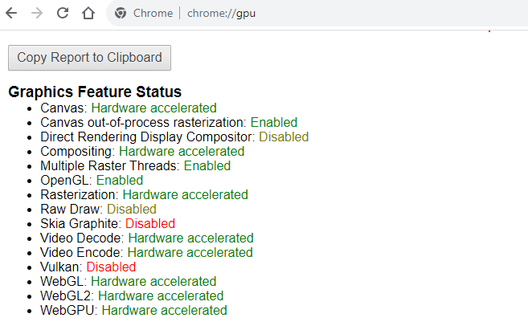
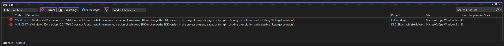

Project 0 Getting Started
====================

**University of Pennsylvania, CIS 565: GPU Programming and Architecture, Project 0**

* Zhiyu Lei
  * [LinkedIn](https://www.linkedin.com/in/zhiyu-lei/), [Github](https://github.com/Zhiyu-Lei)
* Tested on: Windows 22, i7-2222 @ 2.22GHz 22GB, GTX 222 222MB (CETS Virtual Lab)

### Part 3.1.1: Modify the CUDA Project and Take a ScreenShot

### Part 3.1.2: Analyze
I have trouble completing this part right now. When selecting machine under 'Localhost connection' in step 4, I was prompted to enter an admin user name and password which I do not have access to.

### Part 3.1.3: Nsight Debugging

### Part 3.2: WebGL

### Part 3.3: DXR
I have trouble building this solution right now. The following are the errors:

