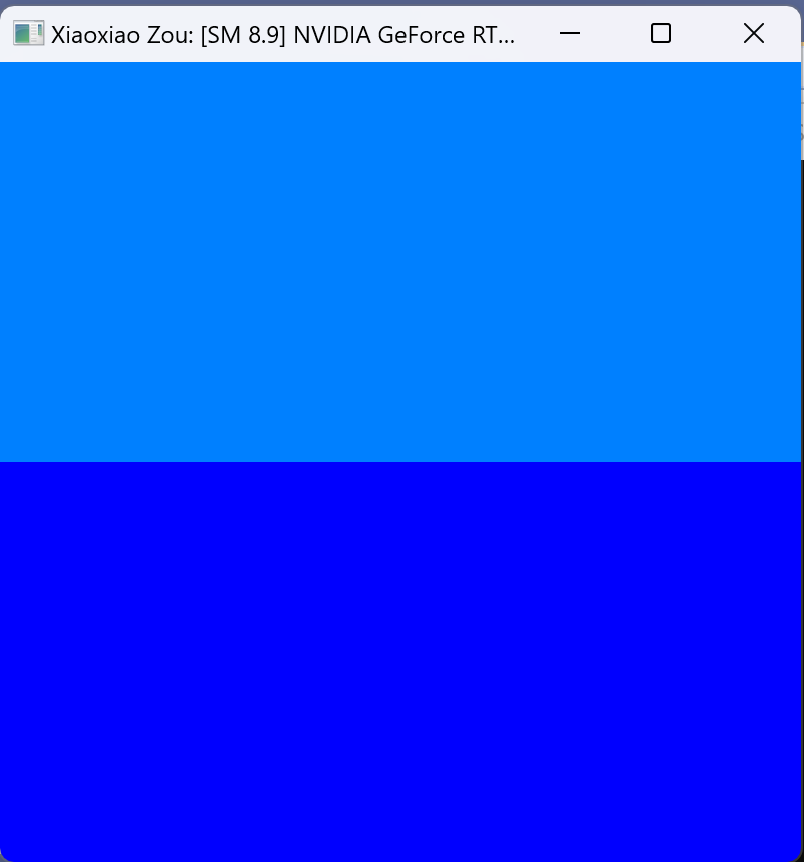
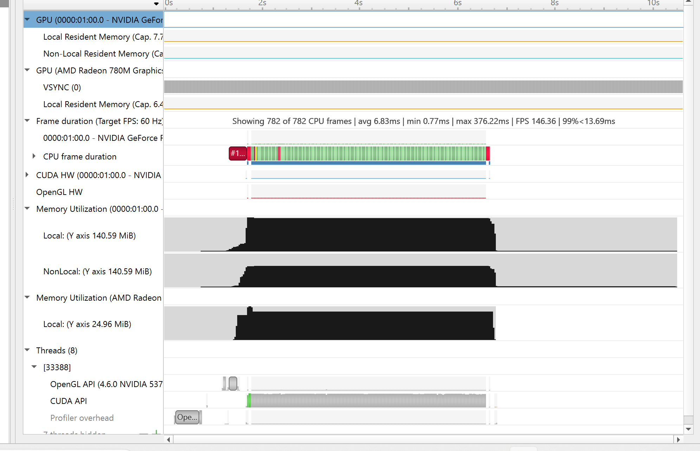
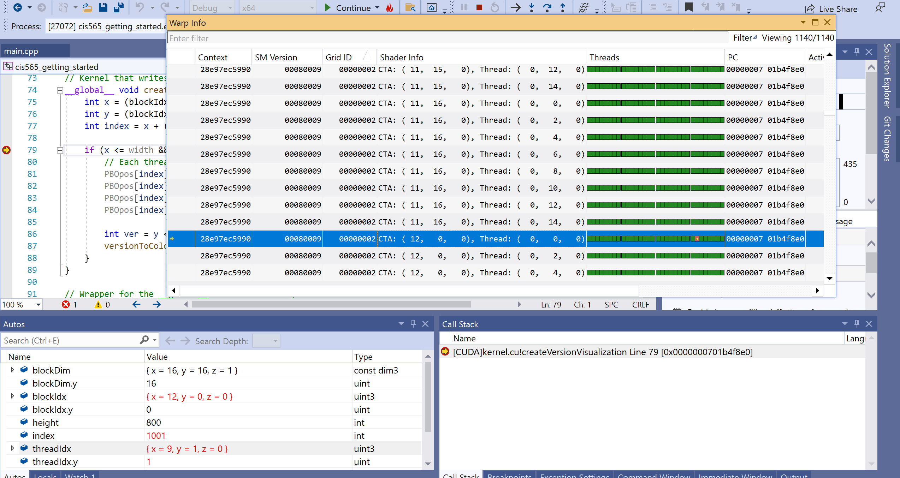
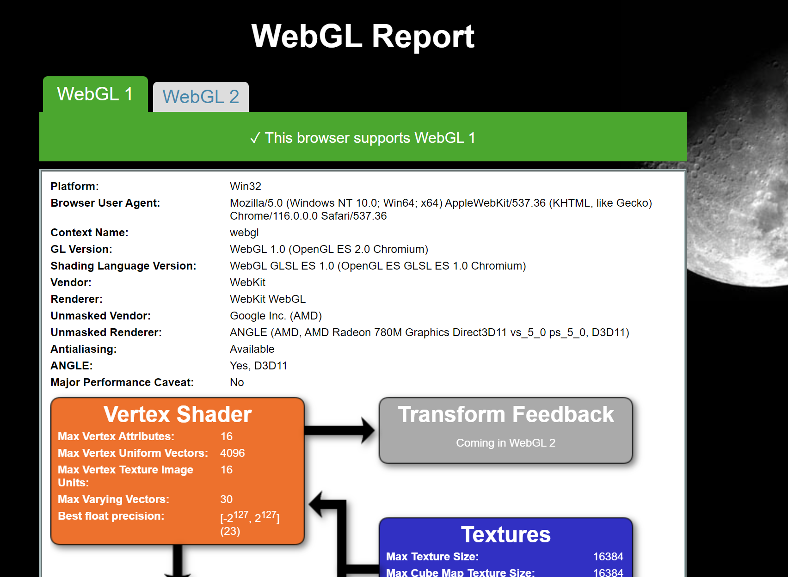
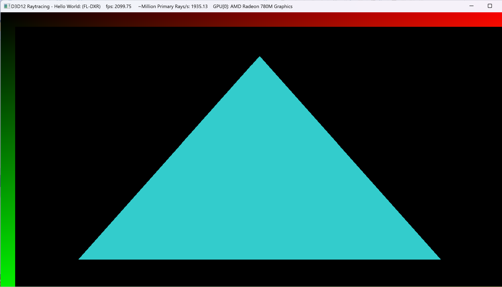

Project 0 Getting Started
====================

**University of Pennsylvania, CIS 565: GPU Programming and Architecture, Project 0**

* Xiaoxiao Zou
  * [LinkedIn](https://www.linkedin.com/in/xiaoxiao-zou-23482a1b9/), [personal website](), [twitter](), etc.
* Tested on: Windows 11, AMD Ryzen 9 7940HS @ 4.00 GHz, RTX 4060 Laptop 

Include screenshots, analysis, etc. (Remember, this is public, so don't put
anything here that you don't want to share with the world.)

