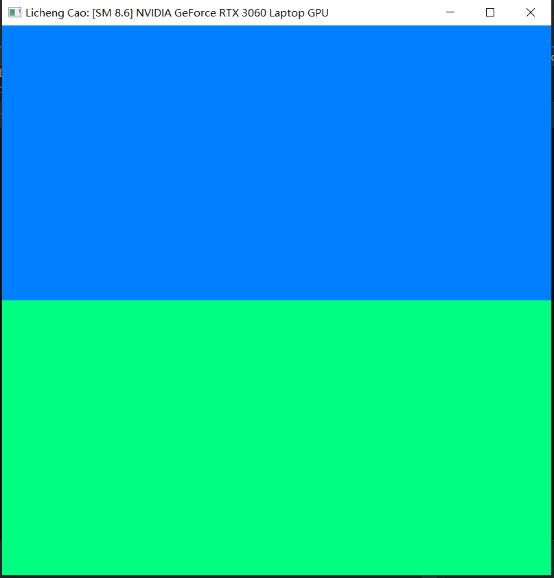
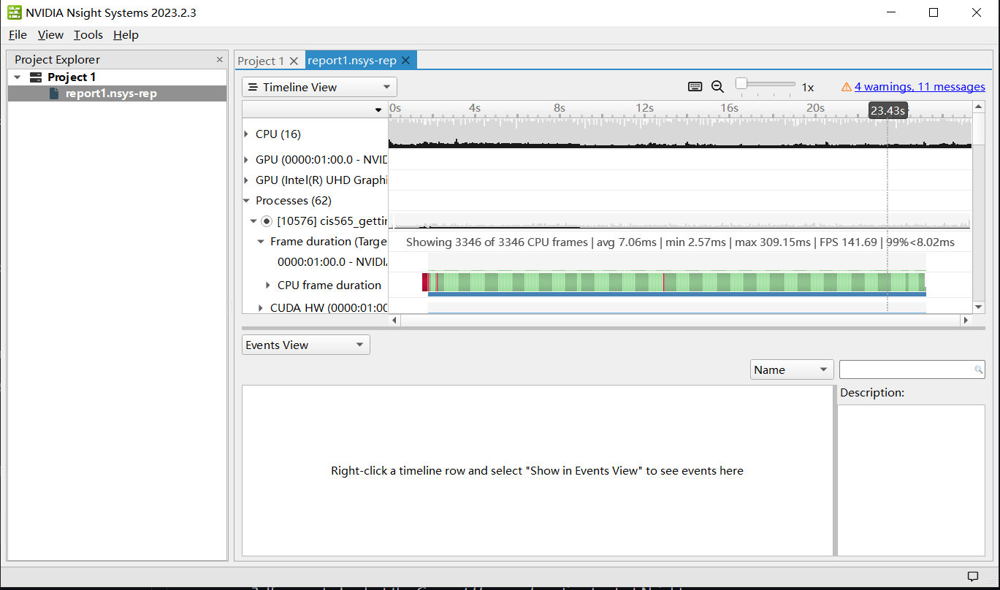
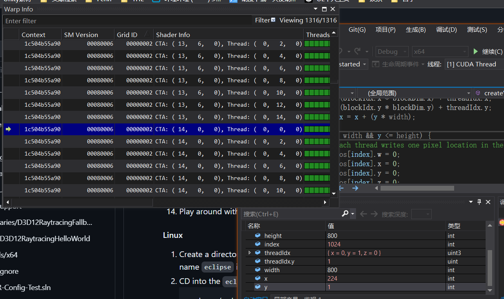
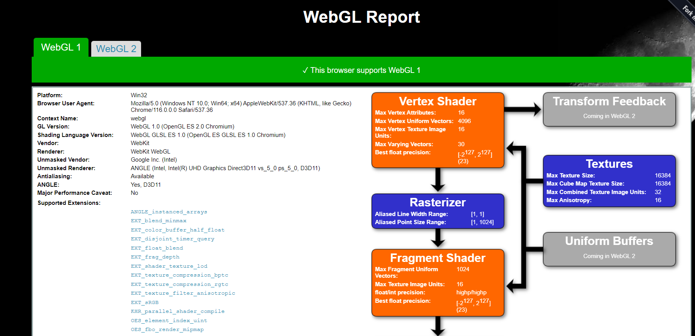
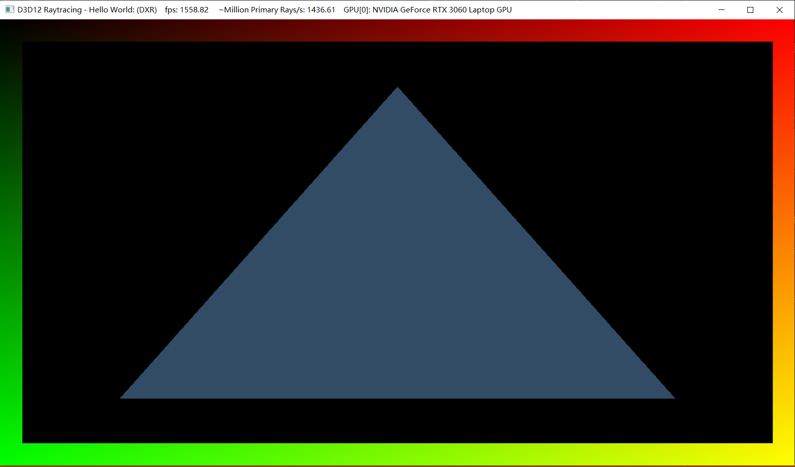

Project 0 Getting Started
====================

**University of Pennsylvania, CIS 565: GPU Programming and Architecture, Project 0**

* Licheng Cao
* [LinkedIn](https://www.linkedin.com/in/licheng-cao-6a523524b/)
* Tested on: Windows 10, i7-10870H @ 2.20GHz 32GB, GTX 3060 6009MB

###

Include screenshots, analysis, etc. (Remember, this is public, so don't put
anything here that you don't want to share with the world.)

