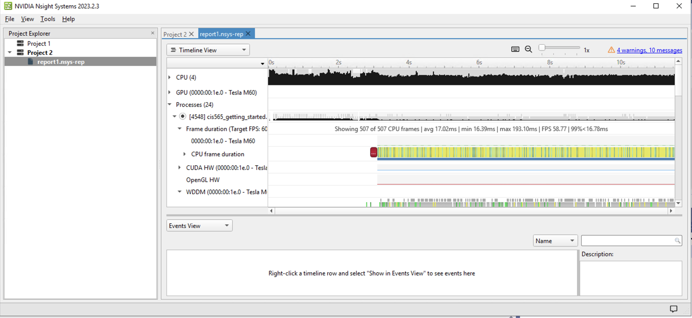
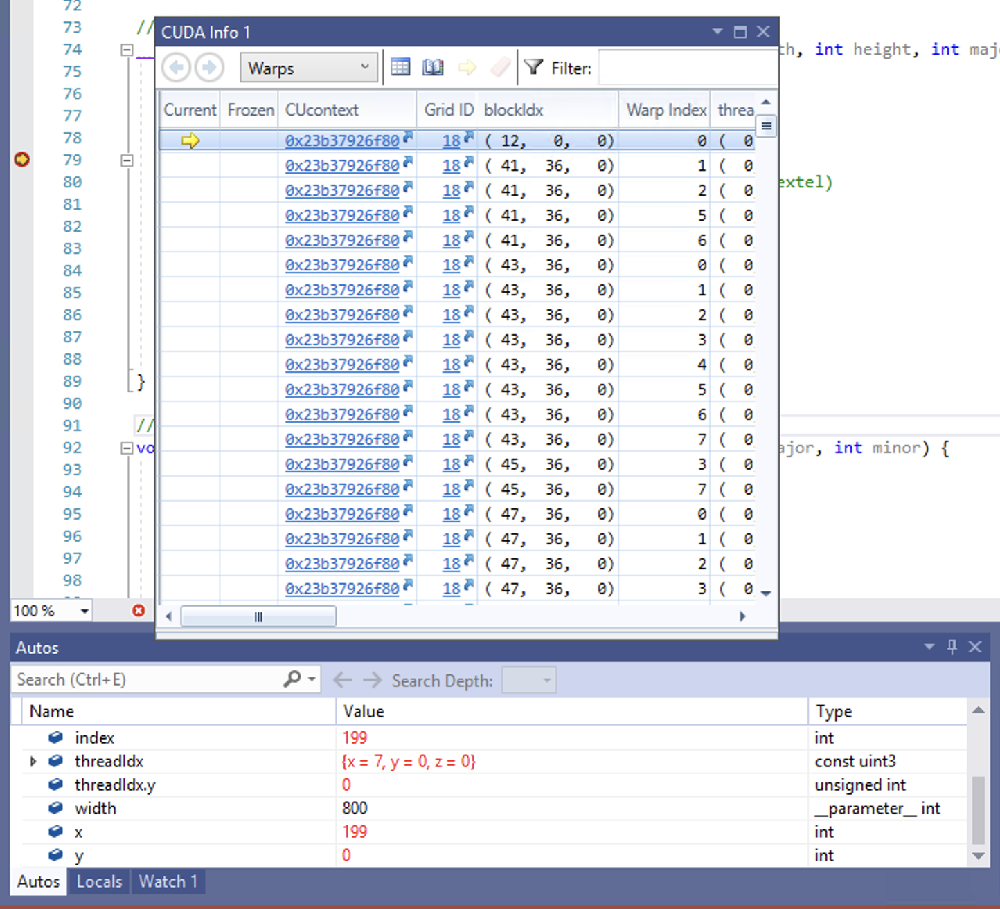
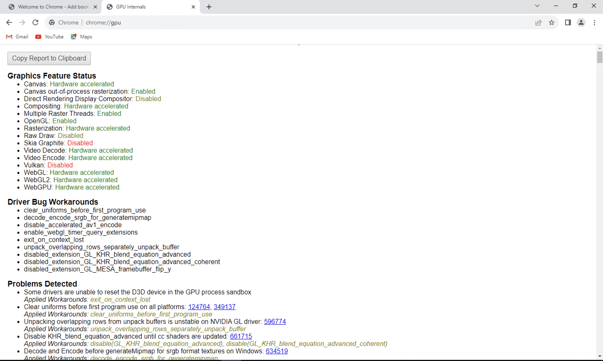

Project 0 Getting Started
====================

**University of Pennsylvania, CIS 565: GPU Programming and Architecture, Project 0**

* Xuanzhuo Xu
  * [LinkedIn](https://www.linkedin.com/in/xuanzhuoxu/), [personal website](https://www.linkedin.com/in/xuanzhuoxu/), [github](https://github.com/PKUxxz), etc.
* Tested on: Windows Server 2019, E5-2686 @ 2.30GHz 30.5GB, Tesla M60 8GB (AWS g3s.xlarge)

### (TODO: Your README)
#### Here's the screenshot after running `cis565_`

I encountered multiple problem before getting this, one key probem is, the Tesla computing cards do not support WDDM mode originally. One should purchase the lisence of GRID driver, and manually switch it to WDDM mode, to enable the support of OpenGL. For those who use AWS, a easier way is just to use the launch template with GRID driver with some overhead cost.

#### Here's the screenshot after Nsight Trace

Apart from doing all the things in the manual, one still should install Nsight Extension in Visual Studio manually to see Nsight System options.

#### Here's the screenshot of Nsight Debug

#### Here's the screenshot of WebGL support

Some options is different from those in manual.

#### DXR
About DXR part, I found the Tesla series GPU I'm currently using is not compatiable with the DXR, and using AWS EC2 with GeForce GTX series cards seems way too expensive. And I failed to get the access to SIGLAB machines. The Virtual PC Lab machines loses all the files and settings as the connection lost, and it do happen very often. 

