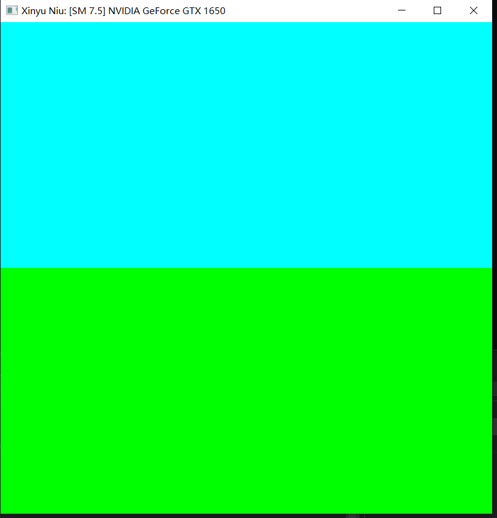
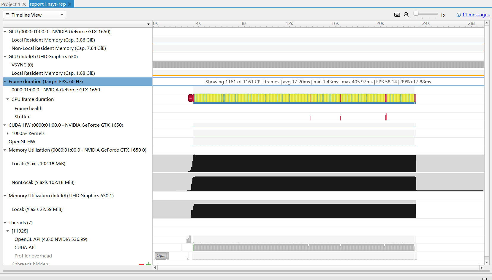
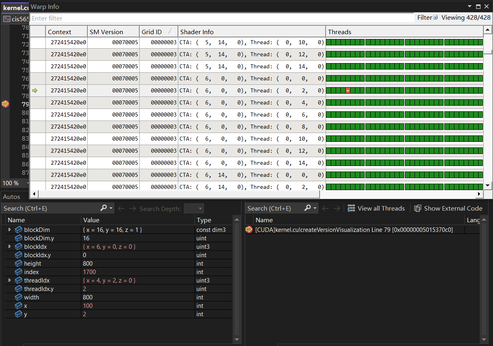
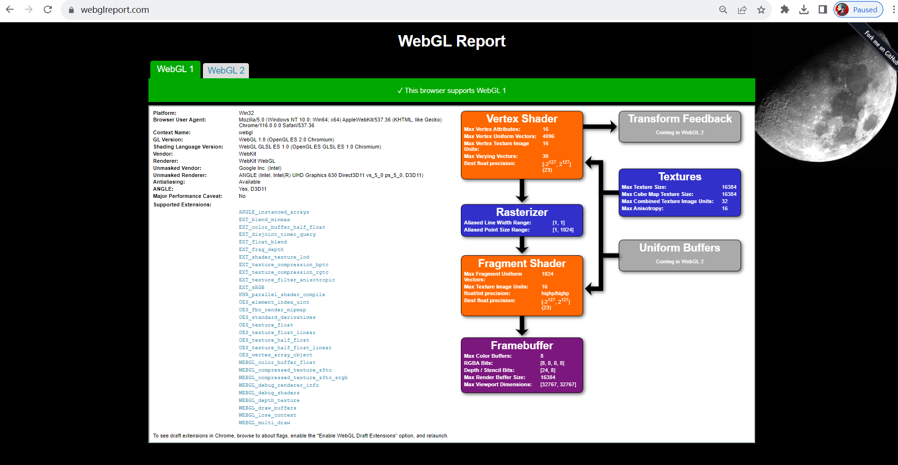
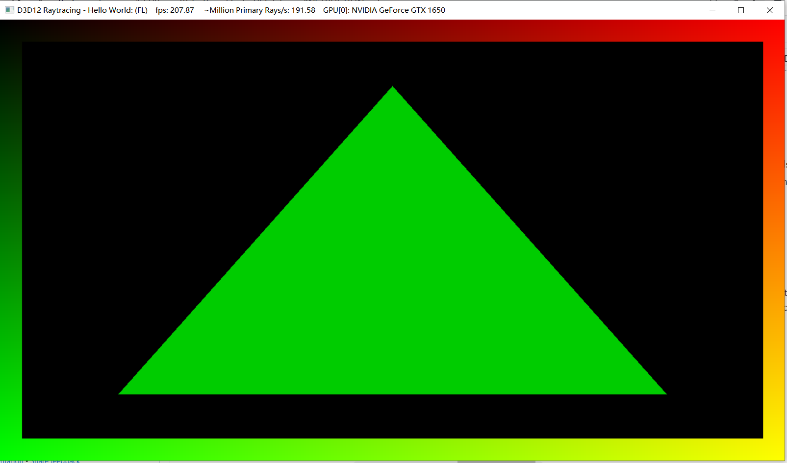

Project 0 Getting Started
====================

**University of Pennsylvania, CIS 565: GPU Programming and Architecture, Project 0**

* Xinyu Niu
  * Personal Site: https://xinyuniu6.wixsite.com/my-site-1
* Tested on: Windows 10, i7-9750H @ 2.60GHz 22GB, GTX 1650 4096MB (personal computer)

### Screenshots

* 3.1.1
  

* 3.1.2
  

* 3.1.3

* 3.2

* 3.3

