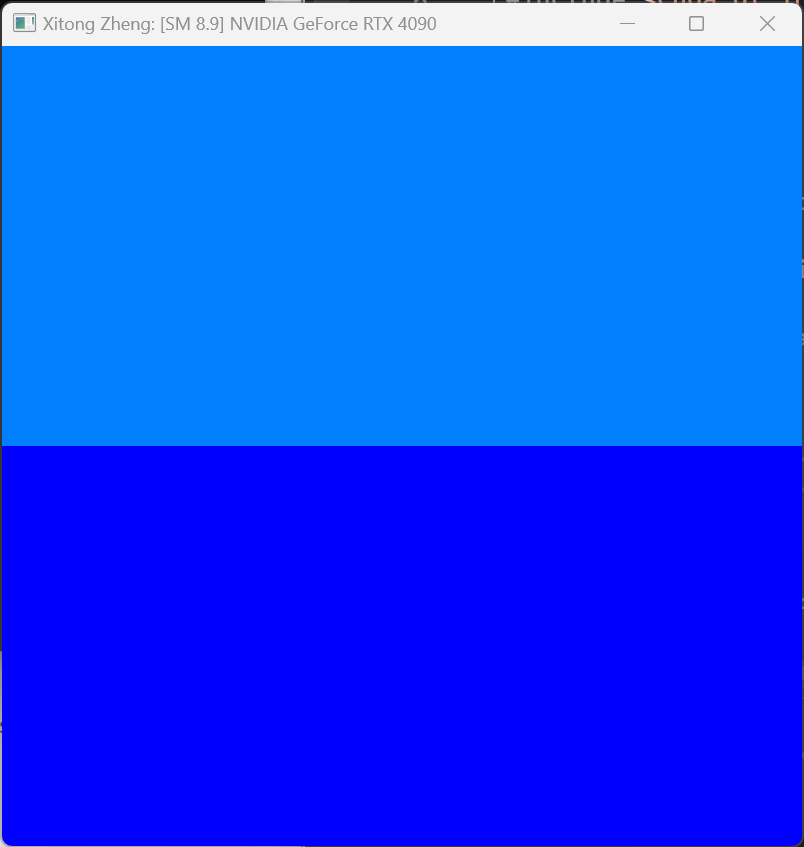
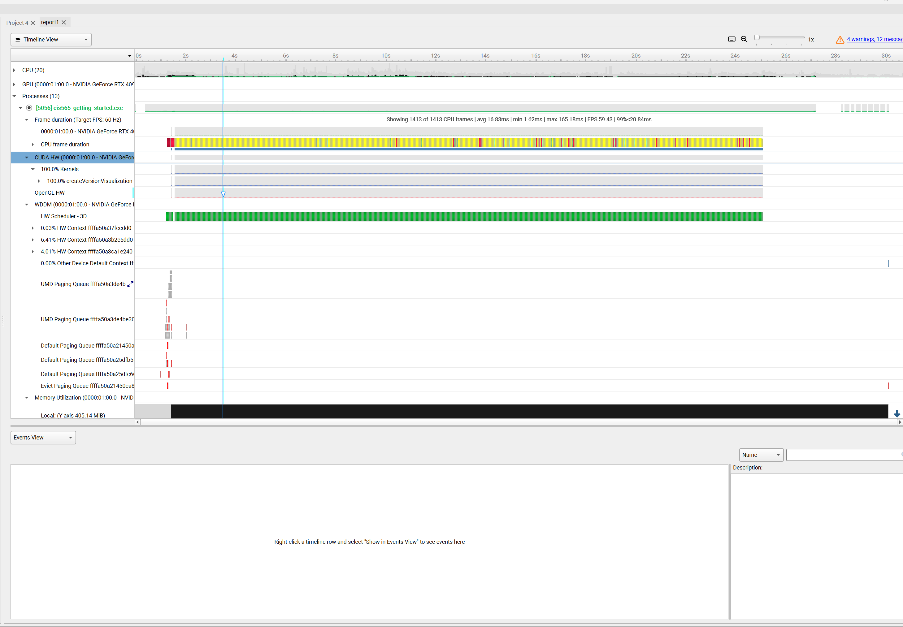
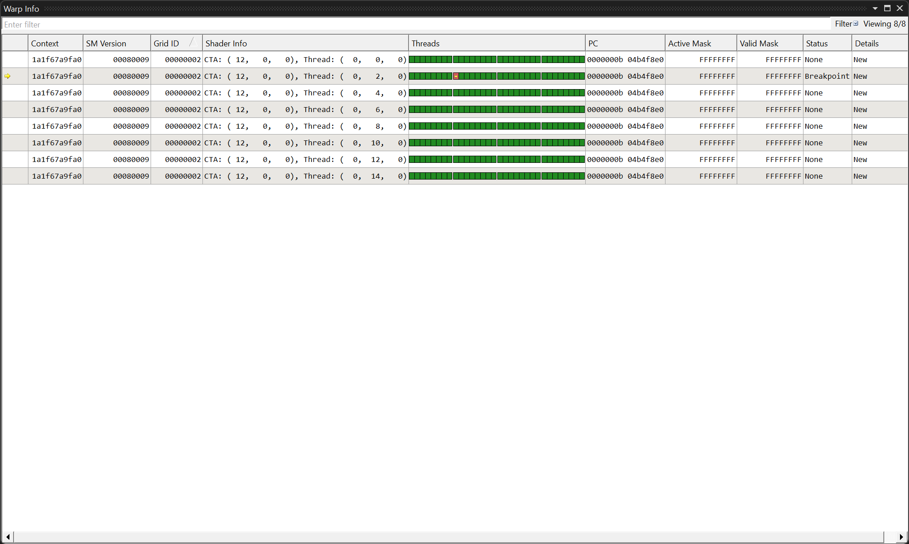
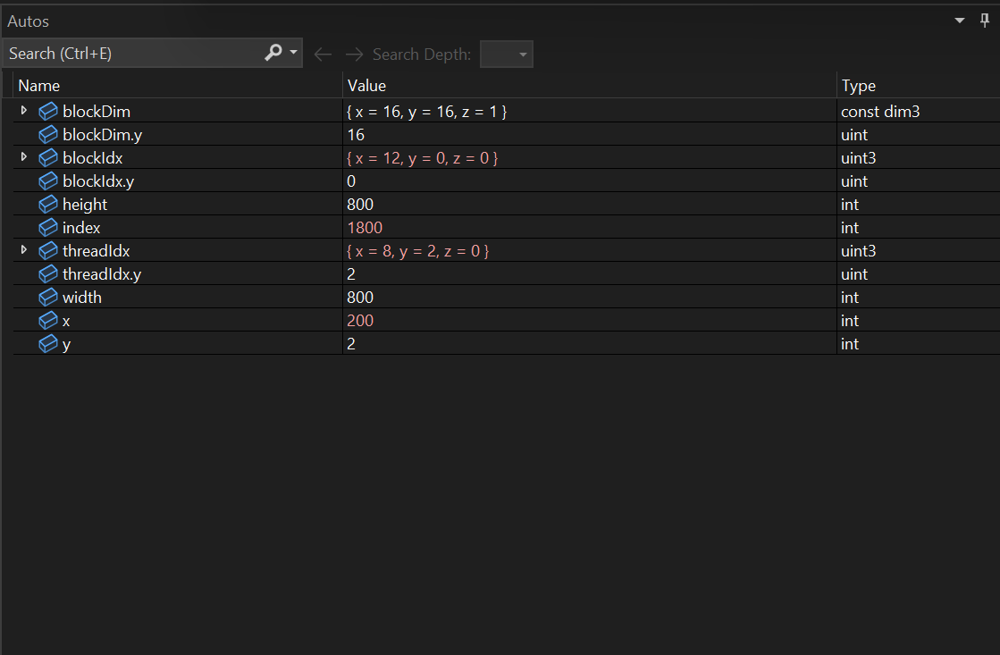
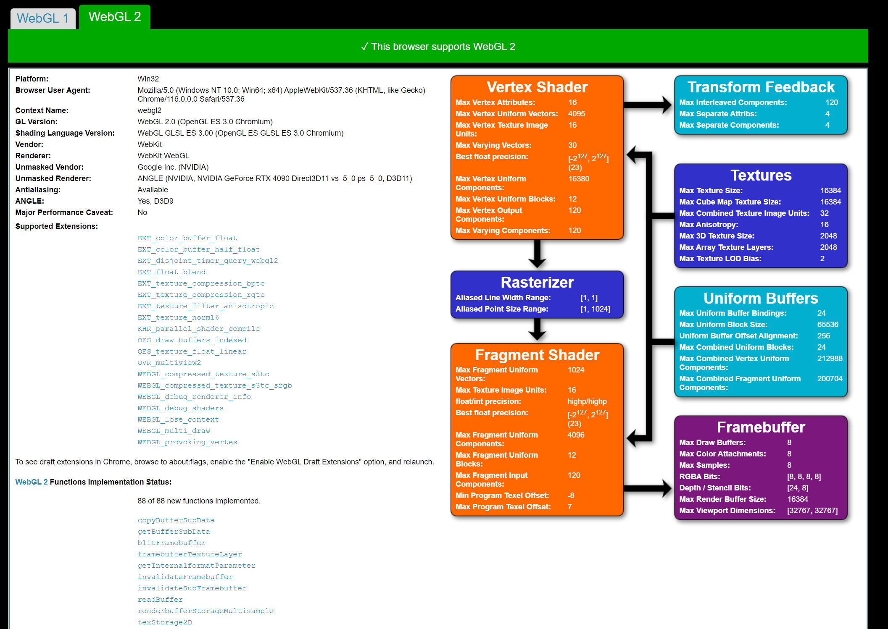
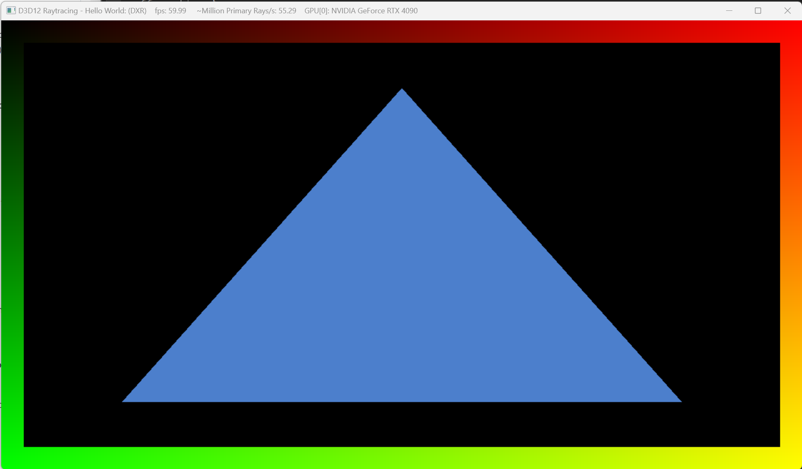

Project 0 Getting Started
====================

**University of Pennsylvania, CIS 565: GPU Programming and Architecture, Project 0**

* Xitong Zheng
  * [LinkedIn](https://www.linkedin.com/in/xitong-zheng-5b6543205/)
* Tested on: Windows 11, i7-12700k 32GB, GTX 4090 

### Add name to project

### Use Nsight System 22.4.2 to analyze

### Nsight Debugging

## WebGL Suppurt Test

## DXR Test
Both FL-DXR and DXR support. Give picture in DXR mode.
