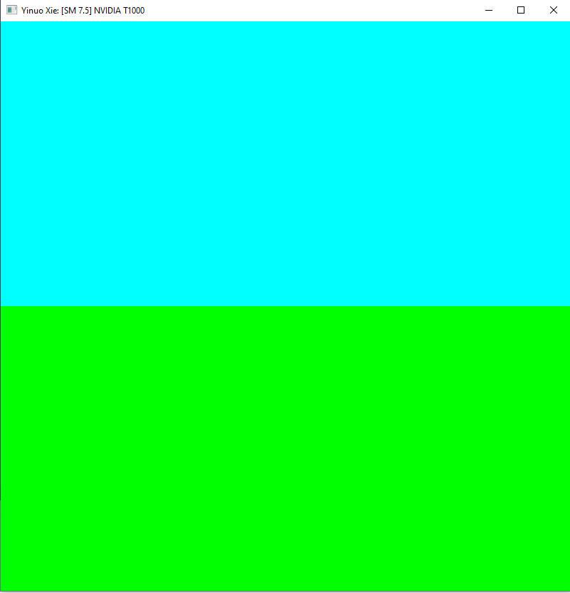
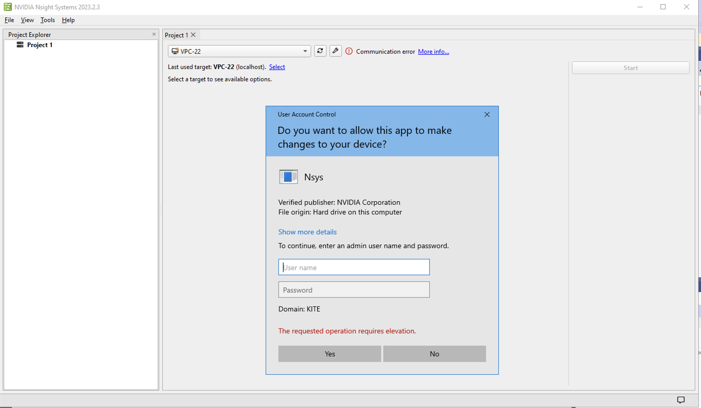
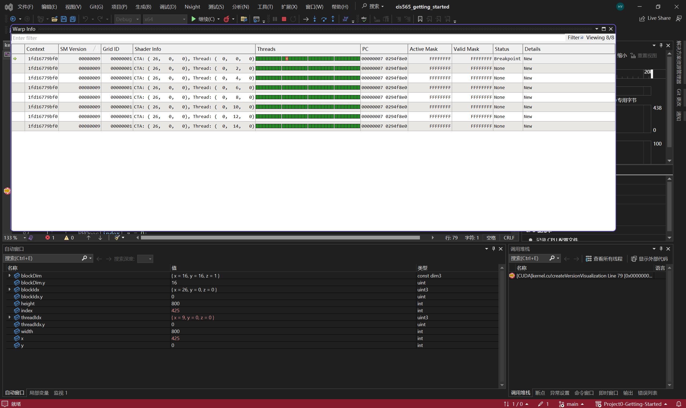

Project 0 Getting Started
====================

**University of Pennsylvania, CIS 565: GPU Programming and Architecture, Project 0**

* Yinuo (Travis) Xie
  * [LinkedIn](https://www.linkedin.com/in/yinuotxie/)
* Tested on: Windows 10, i7-12700 @2.10GHz 32GB, NVIDIA T1000 (Moore Windows PC Lab)

**Screenshots**

* Part 3.1.1: Cuda

* Part 3.1.2: Analyze

I've got a Mac laptop, so I need to use either the Moore Lab or the CETS virtual lab for the project. But I can't run the Nsight analysis since I don't have admin rights.

* Part 3.1.3: Nsight Debugging 

* Part 3.2: WebGL

* Part 3: DXR
The Moore Windows Lab and the CET virtual lab both lack the Windows SDK version 1809 (10.0.17763.0), and I'm not authorized to install it.
