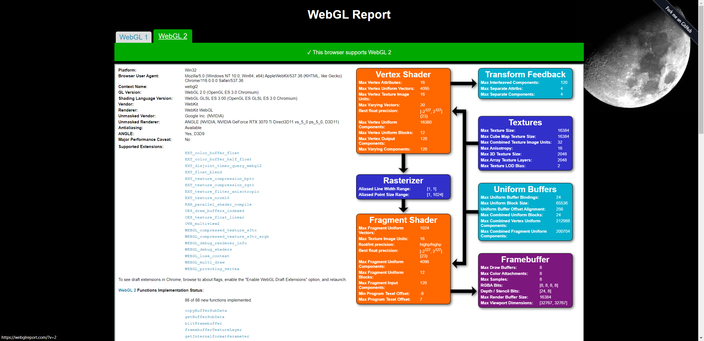

Project 0 Getting Started
====================

**University of Pennsylvania, CIS 565: GPU Programming and Architecture, Project 0**

* Ruijun(Daniel) Zhong
    * https://www.linkedin.com/in/daniel-z-73158b152/
* Tested on:WIN-U4SG3FGFIQE, 12th Gen Intel(R) Core(TM) i7-12700K 3.61 GHz 32.0 GB (31.7 GB usable), NVIDIA GeForce RTX 3070 Ti (personal computer)

.png)

