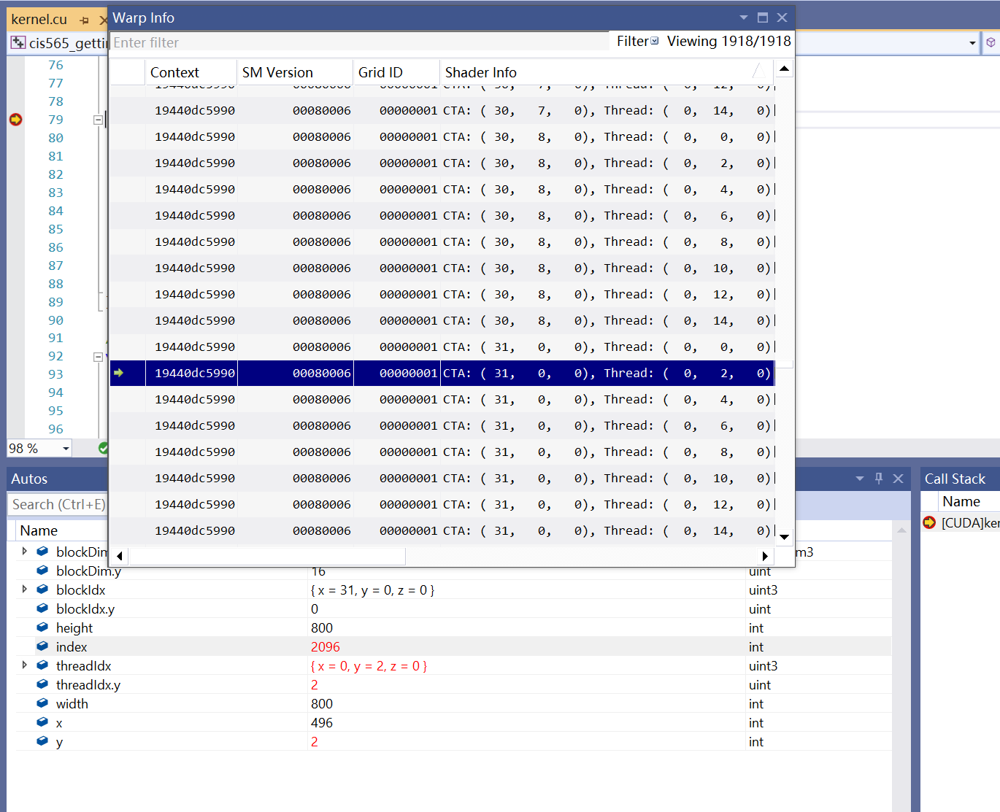
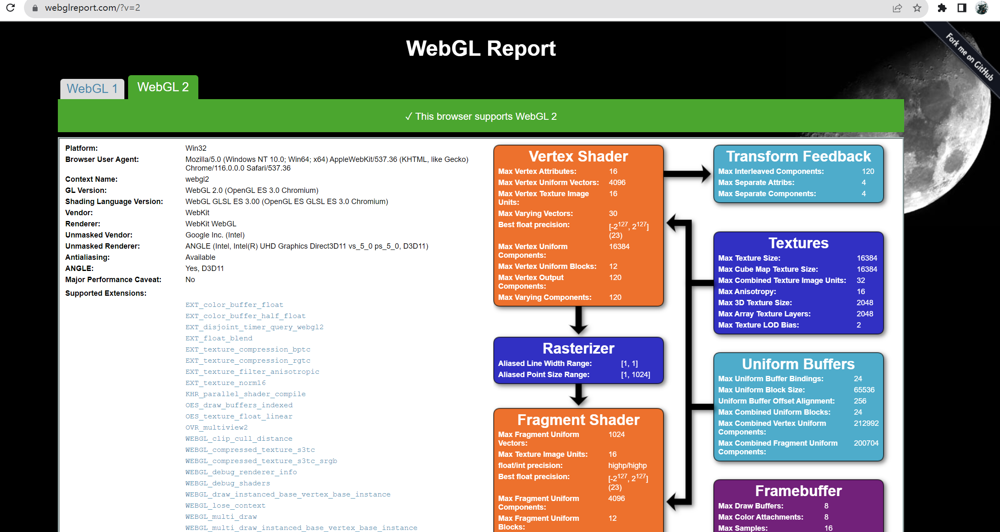
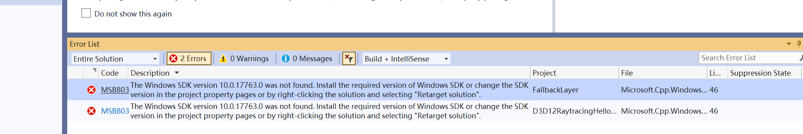

Project 0 Getting Started
====================

**University of Pennsylvania, CIS 565: GPU Programming and Architecture, Project 0**

* Han Wang
  * 
* Tested on:  Windows 11, 11th Gen Intel(R) Core(TM) i9-11900H @ 2.50GHz   2.50 GHz 24GB, GeForce RTX 3070 

### My readMe

Part3.11

part4 debug

part5 webgl

I'm sorry that I have a windows11 computer and I can't use windows sdk version 10.0.17763
proof:

