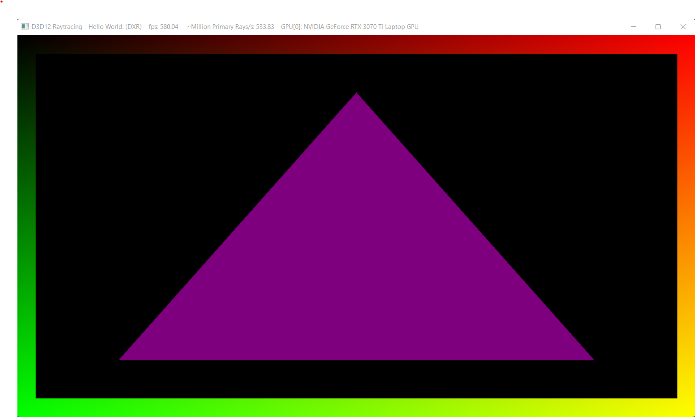

Project 0 Getting Started
====================

**University of Pennsylvania, CIS 565: GPU Programming and Architecture, Project 0**

* Tianyi Xiao
  * [LinkedIn](https://www.linkedin.com/in/tianyi-xiao-20268524a/), [personal website](https://jackxty.github.io/), [Github](https://github.com/JackXTY).
* Tested on: Windows 11, i9-12900H @ 2.50GHz 16GB, Nvidia Geforce RTX 3070 Ti 8032MB (Personal Laptop)

* Compute capability: 8.6

### CUDA

### Analysis

### Nsight Debug

### WebGL

### DXR

