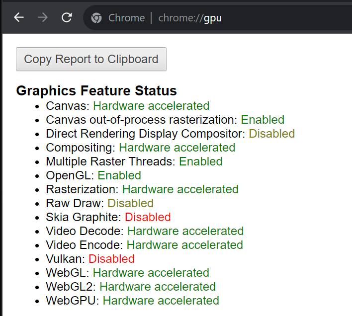

Project 0 Getting Started
====================

**University of Pennsylvania, CIS 565: GPU Programming and Architecture, Project 0**

* Yuanqi Wang
  * [LinkedIn](https://www.linkedin.com/in/yuanqi-wang-414b26106/), [GitHub](https://github.com/plasmas).
* Tested on: Windows 11, i5-11600K @ 3.91GHz 32GB, RTX 2060 6GB (Personal Desktop)

## Screenshots

### Part 3.1.1

### Part 3.1.2

### Part 3.1.3

### Part 3.2

### Part 3.3

