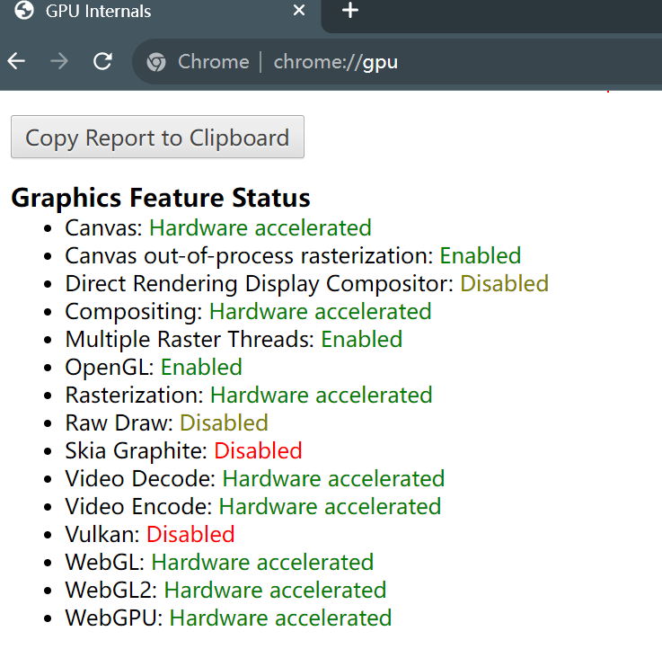

Project 0 Getting Started
====================

**University of Pennsylvania, CIS 565: GPU Programming and Architecture, Project 0**

* Xiaoyue Ma
  * [LinkedIn](https://www.linkedin.com/in/xiaoyue-ma-6b268b193/)
* Tested on: Windows 10, i7-12700H @ 2.30 GHz 16GB, GTX3060 8GB

### CUDA Compute Capability: 8.6

1. Cuda project output：

2. Nsight debug：

3. Break point debug：

4. WebGL support：

5. DXR triangle：

