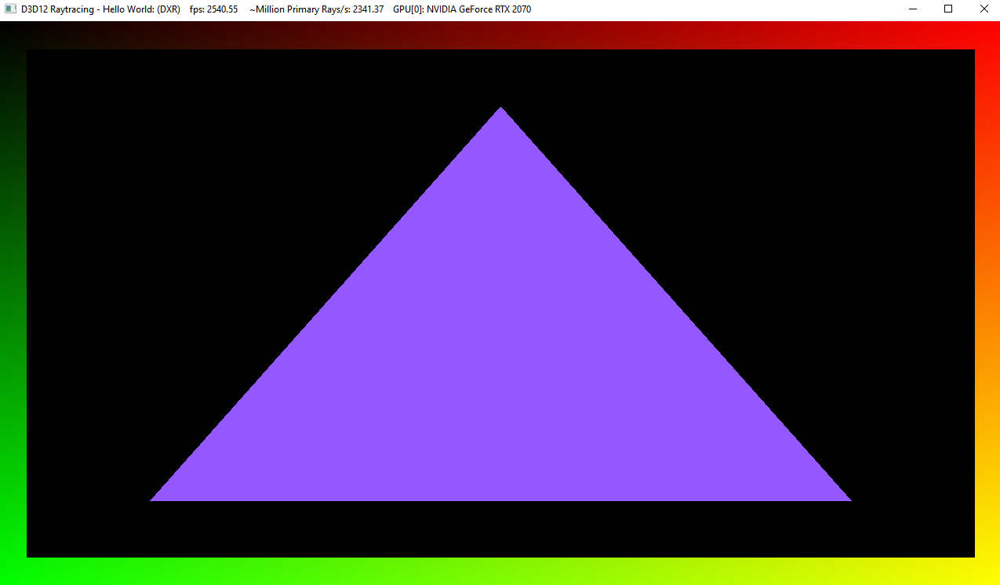

# Project 0: Getting Started

**University of Pennsylvania, CIS 565: GPU Programming and Architecture, Project 0**

* Aditya Gupta
  * [Website](http://adityag1.com/), [GitHub](https://github.com/AdityaGupta1), [LinkedIn](https://www.linkedin.com/in/aditya-gupta1/), [3D renders](https://www.instagram.com/sdojhaus/)
* Tested on: Windows 10, i7-10750H @ 2.60GHz 16GB, NVIDIA GeForce RTX 2070 8GB (personal laptop)
  * Compute capability: 7.5

### README

#### CUDA project

#### Analysis

#### Nsight debugging

#### WebGL

#### DXR

